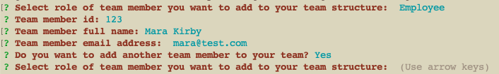
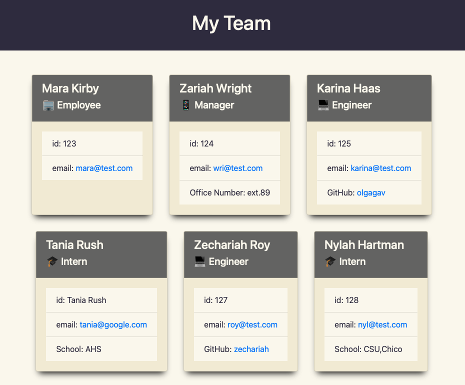

  # Command-line application 'Generate My Team profile'

  

  ## Description
  
  This application help generate html style contacts of the team

  

  ## Table of Contents
 
  - [Installation](#installation)
  - [Usage](#usage)
  - [Credits](#credits)
  - [License](#license)
  - [Questions](#questions)
  - [Contribution](#contribution)
  - [Tests](#tests)
    
  ## Installation
  
  - clone the project 
  - run node index.js
  
  ## Usage
  
  To generate profile with team member contacts you can choose types: 
  
  - Employee
  - Manager
  - Engineer
  - Intern
  s
  1. run the application from the command line
  2. add all your team members, answering the questions
  3. dist/index.html when you complete adding all team members

  A walkthrough video demonstrating the functionality of the application: 

  https://drive.google.com/file/d/1oXlszmUiPBBGLiydMtNfLtMY5KiCVAbz/view

  
  
  ## Credits
  
  Olga Gavrushenko

  Learning materials [Berkley Extension: coding bootcamp](https://extension.berkeley.edu/)

  Instructor: Robert Wijtman 
  
  ## License
  
  

  This application is available under the license: MIT License.
  
  See the LICENSE file for more info. Full details available by link https://choosealicense.com/licenses/mit/. 
    
 
  ## Questions
  
  Link to my GitHub profile https://github.com/olgagav/

  
  If you have additional questions or proposals please email me: [ogavby@gmail.com](mailto:ogavby@gmail.com?subject=[GitHub]%20command-line%20password%20generator)
    
  ## Contribution

  Contributions are what make the open source community such an amazing place to learn, inspire, and create. Any contributions you make are greatly appreciated.

  - Fork the Project
  - Create your Feature Branch
  - Commit your Changes
  - Push to the Branch
  - Open a Pull Request
  
  ## Tests
  
  ``npm run test``
  
  **Note:** make sure to run ‘npm install’ before running tests
  
  

  To run unit tests with coverage and see all tests grouped by functionality run:

  ``npm run test -- --verbose --coverage``

  